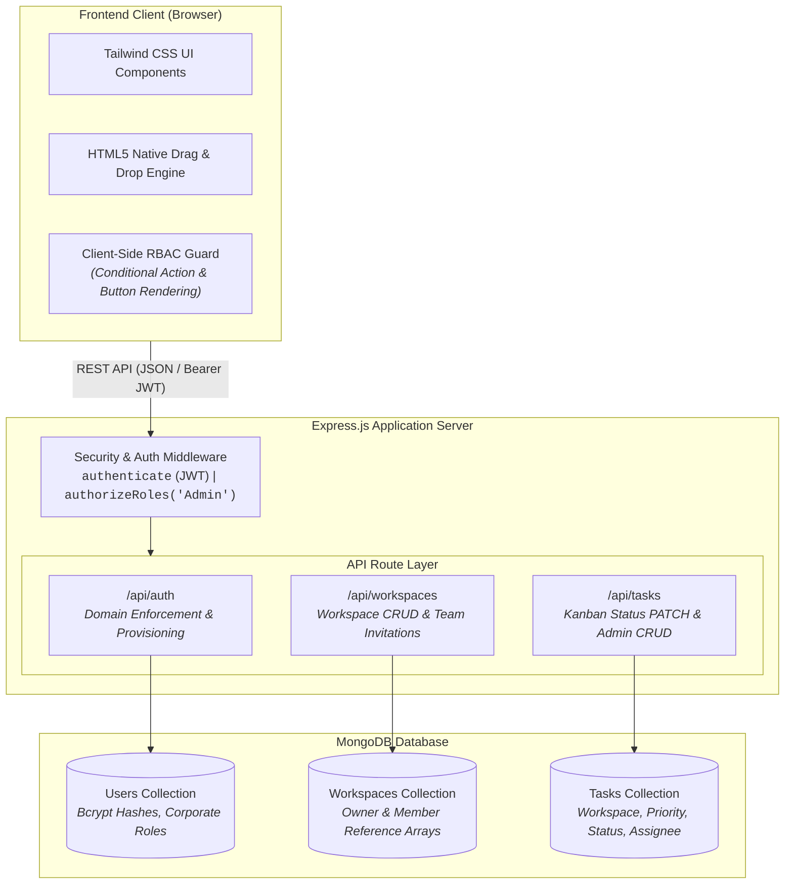
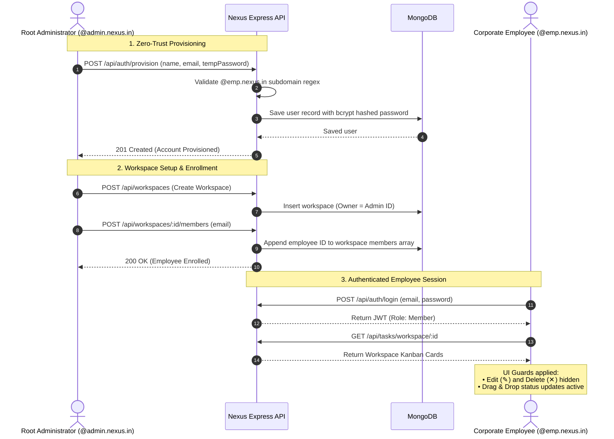
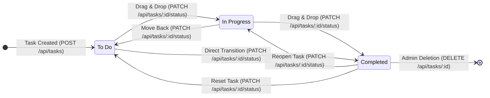

# Nexus — Enterprise Collaborative Workspace

Nexus is an enterprise-grade collaborative task management workspace designed with a zero-trust corporate provisioning model. It eliminates public self-registration in favor of administrator-controlled onboarding, enforces corporate subdomain routing (`@admin.nexus.in` vs `@emp.nexus.in`), and features a real-time interactive Kanban board powered by the native HTML5 Drag and Drop API.

---

## 📐 System Architecture Diagram



---

## 🛡️ Enterprise RBAC & Domain Governance

Nexus enforces separation of concerns across corporate identities:

| Entity | Domain Pattern | Role | Capabilities |
| :--- | :--- | :--- | :--- |
| **Administrator** | `*@admin.nexus.in` | `Admin` | Provision employees, create workspaces, invite members, modify full task details (title, description, priority, assignee), delete tasks. |
| **Employee** | `*@emp.nexus.in` | `Member` | View assigned workspaces, create tasks, inspect details, drag & drop cards across Kanban columns (`To Do`, `In Progress`, `Completed`). |

### Provisioning & Workspace Enrollment Workflow



---

## 📋 Kanban Board Lifecycle



---

## 🚀 Key Features

* **Zero-Trust Account Onboarding:** No public signup endpoints exist. All accounts must be provisioned by an authenticated Admin.
* **Domain Guardrails:** Server-side regex validation prevents unauthorized domain registrations (`@gmail.com`, `@yahoo.com`, etc.).
* **Automated Seed Mechanism:** Integrated self-bootstrap logic initializes a root administrator on server launch if none exists.
* **HTML5 Native Drag-and-Drop:** Lightweight, dependency-free card transitions between workflow stages with instant database persistence.
* **Granular Task Controls:** Employees can update progression states freely, while title/description/priority edits and task deletions are reserved for Admins.

---

## 📂 Project Structure

```text
collaborative-workspace/
├── middleware/
│   └── auth.js             # JWT verification & role authorization guards
├── models/
│   ├── Task.js             # Task schema (status, priority, assignee)
│   ├── User.js             # User schema with pre-save hashing & domain validation
│   └── Workspace.js        # Workspace schema & member references
├── public/
│   ├── js/
│   │   └── dashboard.js    # Client-side state, drag-drop bindings, & UI logic
│   ├── dashboard.html      # Responsive 3-column Kanban interface
│   └── signin.html         # Corporate authentication portal
├── routes/
│   ├── authRoutes.js       # Corporate sign-in & admin provisioning routes
│   ├── taskRoutes.js       # Task CRUD, status updates, & permission checks
│   └── workspaceRoutes.js  # Workspace creation & team invitation routes
├── .env                    # Environment variables (git-ignored)
├── .gitignore              # Ignored files (node_modules, .env)
├── package.json            # Dependencies and npm scripts
├── seedAdmin.js            # Standalone root administrator seeding utility
└── server.js               # Entrypoint, static server, & MongoDB connection
```

---

## ⚙️ Installation & Setup

### 1. Prerequisites

* **Node.js:** v18.0.0 or higher
* **MongoDB:** Local daemon on `mongodb://127.0.0.1:27017` or a MongoDB Atlas URI

### 2. Clone & Install

```bash
git clone <your-repository-url>
cd collaborative-workspace
npm install
```

### 3. Configure Environment Variables

Create a `.env` file in the project root:

```env
PORT=5000
MONGO_URI=mongodb://127.0.0.1:27017/nexus
JWT_SECRET=nexus_super_secret_enterprise_key_2026
ROOT_ADMIN_EMAIL=superadmin@admin.nexus.in
ROOT_ADMIN_PASSWORD=AdminRoot123!
```

### 4. Initialize Database & Seed Administrator

Run the dedicated seeding script:

```bash
node seedAdmin.js
```

Default seeded administrator credentials:
* **Corporate Email:** `superadmin@admin.nexus.in`
* **Password:** `AdminRoot123!`
* **Role:** `Admin`

### 5. Launch the Server

```bash
node server.js
```

The application will be live at `http://localhost:5000/signin.html`.

---

## 🧪 Verification Walkthrough

### 1. Administrator Session

1. Navigate to `http://localhost:5000/signin.html`.
2. Sign in as `superadmin@admin.nexus.in` using `AdminRoot123!`.
3. Under **Create Workspace**, input `Sprint 1 - Core Services` and submit.
4. Under **Provision Employee**, onboard a test team member:
   * **Full Name:** `Rahul Sharma`
   * **Corporate Email:** `rahul@emp.nexus.in` *(must use `@emp.nexus.in`)*
   * **Initial Password:** `EmpPass123!`
5. Click **+ Invite Member** in the top action bar, enter `rahul@emp.nexus.in`, and confirm.
6. Click **+ Add Task**, populate the fields, assign the card to Rahul, and save.

### 2. Employee Session

1. Open a new private/incognito browser window.
2. Sign in at `http://localhost:5000/signin.html` as `rahul@emp.nexus.in` with `EmpPass123!`.
3. Confirm that the Provisioning and Workspace creation cards are hidden.
4. Confirm that the edit (`✎`) and delete (`✕`) controls on task cards are absent.
5. Drag the assigned task card from **To Do** to **In Progress** and refresh the page to confirm persistent status sync.

---

## 📡 API Reference

### Authentication & Provisioning (`/api/auth`)

| HTTP Method | Route | Authorization | Purpose |
| :--- | :--- | :--- | :--- |
| `POST` | `/api/auth/login` | Public | Authenticates corporate credentials and returns JWT |
| `POST` | `/api/auth/provision` | `Admin` Only | Provisions `@emp.nexus.in` or `@admin.nexus.in` accounts |

### Workspaces (`/api/workspaces`)

| HTTP Method | Route | Authorization | Purpose |
| :--- | :--- | :--- | :--- |
| `GET` | `/api/workspaces` | Authenticated | Fetches all accessible workspaces for the user |
| `POST` | `/api/workspaces` | `Admin` Only | Creates a new workspace entity |
| `POST` | `/api/workspaces/:id/members` | Owner / `Admin` | Adds an employee to an existing workspace |

### Tasks (`/api/tasks`)

| HTTP Method | Route | Authorization | Purpose |
| :--- | :--- | :--- | :--- |
| `GET` | `/api/tasks/workspace/:id` | Workspace Members | Fetches all tasks associated with a workspace |
| `POST` | `/api/tasks` | Workspace Members | Creates a new task inside a workspace |
| `PATCH` | `/api/tasks/:id/status` | Workspace Members | Updates task stage (`To Do`, `In Progress`, `Completed`) |
| `PUT` | `/api/tasks/:id` | Owner / `Admin` | Edits task title, description, priority, or assignee |
| `DELETE` | `/api/tasks/:id` | Owner / `Admin` | Permanently deletes a task |

---

## 📄 License

This project is licensed under the [ISC License](LICENSE).